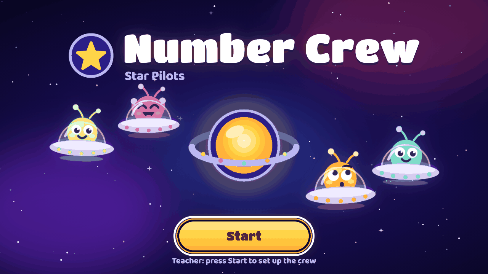
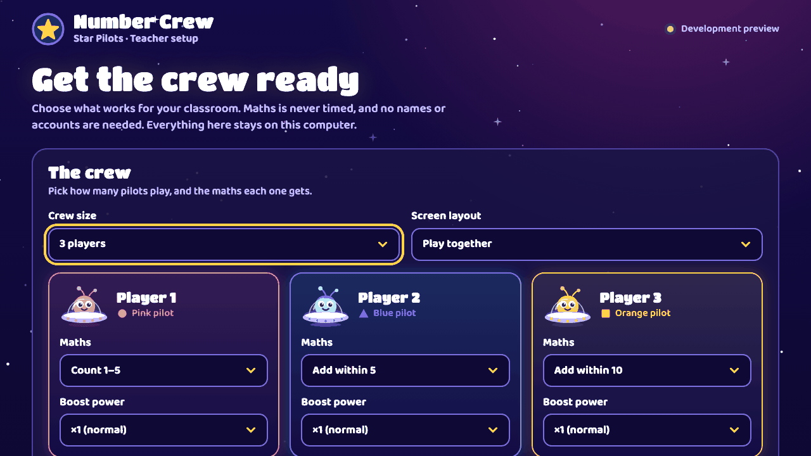
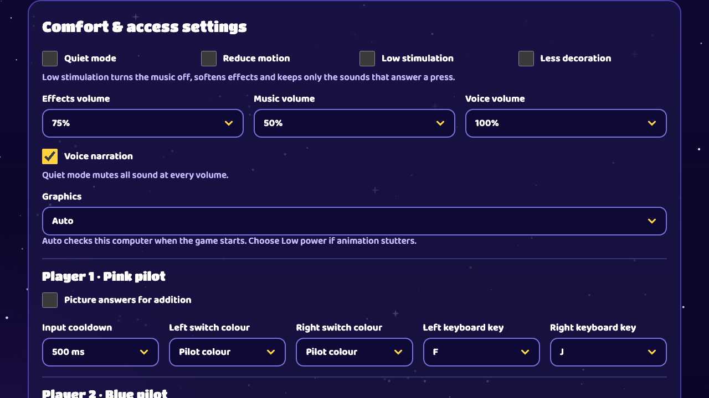
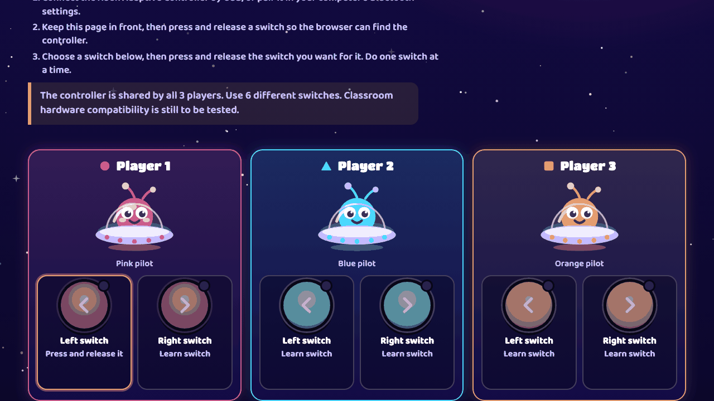
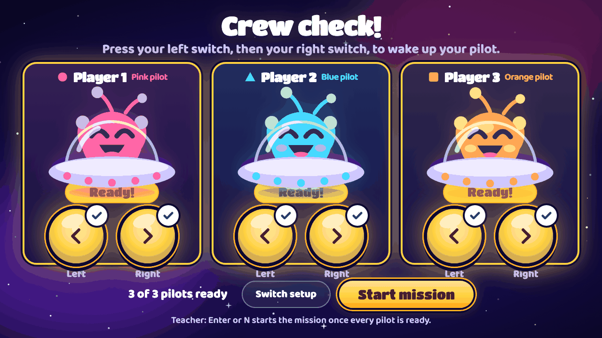
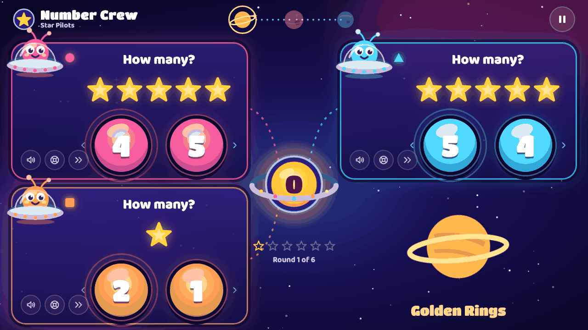
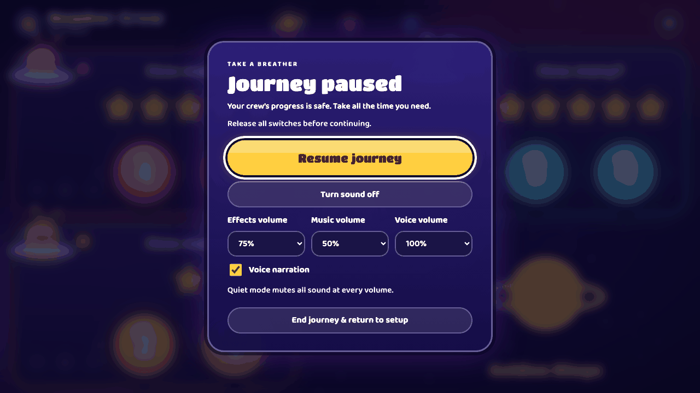
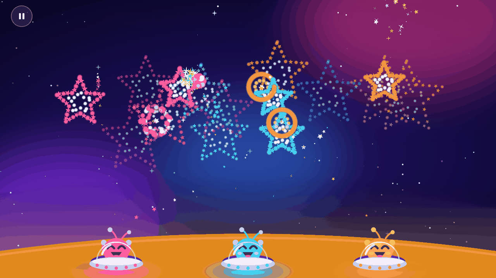
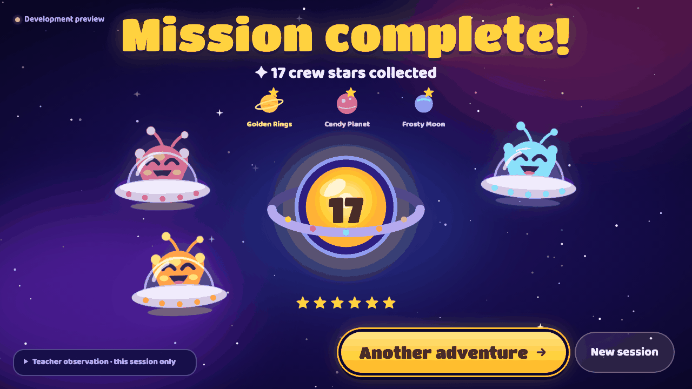
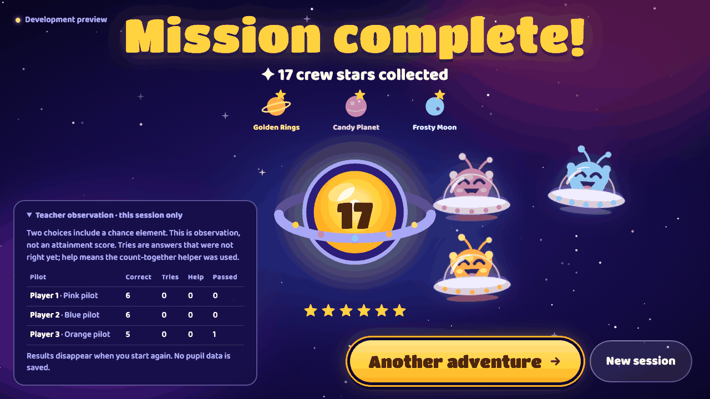

# Number Crew: Star Pilots — teacher guide

Game address: https://mtsku11.github.io/mathsgame/ (the live site shows the earlier build until the Star Pilots version is approved and published).

**Status.** This guide describes the Star Pilots build. The software has automated browser tests, but the game has **not** been tested with the classroom Xbox Adaptive Controller (XAC) or the classroom PC. See "Still not tested" at the end. Please rehearse before the lesson.

Screenshots were taken from the development build, so some show "Development preview" where a published copy shows "Ready offline".

## 1. What the game is

Number Crew is a cooperative maths game for one to four pupils sharing one screen. Each pupil is a space pilot with two big switches: a left answer and a right answer.

- Pupils pick the left or right answer to a counting or addition question. There are six rounds.
- Every correct answer sends a star to the shared mothership. The crew travels to three planets.
- After every maths round there is an optional **boost round**: everyone presses their switches as fast as they like to power a short firework, warp or bubble scene. It cannot be failed.
- Maths is never timed. There is no ranking and no score deduction. Nothing about pupils is saved.

## 2. Before the lesson

1. **PC and browser.** Use Edge or Chrome on the Windows PC. A wired USB connection for the XAC is more reliable than Bluetooth.
2. **First load online.** Open the game address while the PC is online. Go to teacher setup and wait for **Ready offline** at the top right. The same browser profile must keep its site data; clearing it removes the offline copy.
3. **Test offline.** Disconnect the network, reload the page and check it still starts. Do this on the classroom PC, not only on another computer.
4. **XAC.** Plug in the XAC by USB (or pair it in Windows Bluetooth settings). Connect two switches per pupil to different sockets. Staff choose switch positions to suit each pupil.
5. **Sound and screen.** Set the PC volume first, then the game volumes (section 3). Use full screen (F11) if you like. Close other windows so the game stays in front.
6. **Rehearse.** Run a whole mission with your crew size, including one boost round, before the pupils arrive.

The game needs a web server. Do not double-click `index.html`.

## 3. Teacher setup

Press **Start** on the title screen to reach teacher setup. The pupils' switches are not used here; use the mouse, touch or keyboard.

**The crew**

- **Crew size**: 1 to 4 players. Each player has a colour and shape (pink circle, blue triangle, orange square, green) so pupils can find themselves.
- **Screen layout**: *Play together* shows every pilot at once. *Spotlight turns* shows one pilot at a time, larger, while the others rest at the side. In Spotlight turns the question is also read aloud automatically when each turn starts, and **Next player** moves on.
- **Maths** for each player: Count 1–5, Add within 5 or Add within 10. You choose this; the game never raises the level by itself.
- **Boost power** for each player: ×1 (normal), ×2 (double) or ×3 (triple). A pupil who presses slowly can have a higher power so their presses add as much to the boost as anyone else's.

**How will the crew answer?**

- *Xbox Adaptive Controller*: one shared controller, two switches per player. You will set up the switches next.
- *Keyboard & on-screen buttons*: to try the game without a controller. Default keys are Player 1 F and J, Player 2 A and L, Player 3 C and M, Player 4 Q and P (left and right). On-screen answer buttons also work.

**Between rounds**

- **Advance completed rounds automatically**: when every pupil has finished a round, the game moves on by itself after the **Celebration delay** (2 to 10 seconds, default 4). Off by default, so you decide when to move on. It never limits the time to answer, and it waits while the game is paused.

**Boost rounds**

- **Boost round after every maths round**: on by default. Turn it off to play maths only.
- **Start each boost round automatically**: on by default. The boost begins a few seconds after a round is finished. Turn it off and the hub shows a **Boost round!** button for you to press when the crew is ready.
- **Boost length**: 8, 12, 16 or 20 seconds (default 12). Shorter is gentler.
- **Boost difficulty**: Easy, Normal or Hard. This sets how many presses fill the meter. Easy needs the fewest.

**Comfort and access settings** (open the section to see them)

- **Quiet mode** mutes all sound at every volume setting.
- **Reduce motion** replaces travelling and shaking effects with calm fades. It starts on if Windows is set to reduce motion.
- **Low stimulation** turns the music off, softens effects, uses far fewer particles and keeps only the sounds that answer a press. Use it for pupils who find busy scenes or sound hard.
- **Less decoration** removes background decoration.
- **Effects, Music and Voice volume**: Off, 25%, 50%, 75% or 100%.
- **Voice narration**: the narrator reads the questions and cheers the crew. Turn it off if the voice is distracting.
- **Graphics**: *Auto* checks the computer when the game starts and picks High, Medium or Low power. If animation stutters on the classroom PC, choose **Low power**.
- For each player: **Picture answers for addition** (answers shown as groups of objects), **Input cooldown** (0 to 1500 ms, default 500 ms: how long that pupil's switches pause after an answer), **Left and right switch colour** (match the on-screen button to the real switch cap: Red, Orange, Yellow, Green, Blue, Purple, White, Black, or the pilot colour), and the left and right **keyboard keys**.

The game remembers these settings in this browser only. No names or accounts are stored. Sound settings can also be changed while paused.

Press **Set up the switches** (controller) or **Start crew check-in** (keyboard).

## 4. Switch setup (controller only)

1. Connect the XAC. Keep the game page in front and press and release a switch so the browser can see the controller.
2. For each pilot, select **Left switch**, then press and release the switch you want for it. Do one at a time. The game rejects a switch that is already used, and ambiguous presses.
3. When all are learned, press **Start crew check-in**.

The game learns the physical switches; button numbers on screen are the browser's readings, not socket labels. **Live controller diagnostics** at the bottom shows what the browser sees, which helps if a switch does not register. If a button stays "pressed" with all switches released, check the switch and cable before you map it.

Switch mapping is not kept between sessions. You set it up again each time.

## 5. Crew check-in

Every pilot starts asleep. Each pupil presses their left switch, then their right, to wake their pilot. A tick shows each switch has worked. When "**3 of 3 pilots ready**" shows, press **Start mission**, or press **Enter** or **N** on the keyboard.

If a pupil cannot take part yet, **Start anyway** begins with that pilot still asleep. It is always your choice and never needed for the game to work. Use **Switch setup** (or **Back to setup**) to change something.

## 6. During play

Each pilot has a station with the question, their two answer buttons and three small teacher buttons on the left of the station.

**What pupils do**: press the left or right switch. A correct answer sends a star to the mothership. A wrong answer stays in place and the pupil can try again. There is no penalty. With only two choices, a correct answer can be a lucky guess, so treat it as a prompt for conversation, not proof of understanding. Held or bouncing switches do not answer later questions.

**Teacher controls** (mouse, touch or keyboard; none need the pupils' switches)

| Control | What it does |
| --- | --- |
| Speaker button (Say it) | Reads that pilot's question aloud again (needs Voice narration on and sound not muted). |
| Help button | Shows a counting helper for that pilot. It never answers for them, and they still earn the star. |
| Pass button | Lets that pilot travel with the crew without an answer. No star, and it never holds up the group. |
| Next (hub button, **Enter** or **N**) | Appears when every pilot has finished the round. Its label is Next round, Next player (Spotlight turns), Finish journey (round 6) or Boost round!. |
| Pause (round button top right, or **Esc**) | Freezes the game. Questions, stars and progress are kept. |

Use **Tab** to reach the teacher buttons from the keyboard. Enter and N are ignored while a boost is counting down or live, so nobody skips a boost by accident. In keyboard mode, N is left to the pupils if one of them uses it as an answer key.

**Pause** shows volume controls and **End journey & return to setup** (which asks you to confirm and clears the stars). Release all switches before you press **Resume journey**.

The game pauses by itself if the page is hidden or loses focus (for example if someone clicks another window). Click back into the game and resume.

## 7. Boost rounds

After a maths round is finished, a celebration plays and the boost begins (or waits for you if auto-start is off). The stations shrink to a row of saucers along the bottom, a **BOOST ROUND!** card shows, and a 3-2-1-GO countdown runs.

- **What pupils do**: press either of their two switches as often as they like. Every press adds power to one shared meter and fires a bolt or firework from their saucer. Holding a switch counts once; pressing and releasing again counts again.
- **No fail state**: if time runs out, the crew still gets a happy ending. Filling the meter sooner ends the live part sooner. Pressing before GO is ignored.
- **Three scenes** rotate by round: Firework Frenzy (rounds 1 and 5), Warp Drive (rounds 2, 4 and 6; the mothership travels to the next planet) and Bubble Blast (round 3).
- **Nobody is ranked**: each saucer glows with its pupil's recent effort, but no scores, names or "fastest" labels appear anywhere.
- **Gentle on the next question**: after the boost, the next round only starts accepting answers once every switch has been released, so pressing never answers a question by accident.

**Teacher controls during a boost**

- **Pause**: Esc, or the pause button top left. The timer stops.
- **Skip boost round**: in the pause screen. The crew moves on as normal.
- **Shorten or ease it**: choose a shorter Boost length, Easy difficulty, or a higher boost power for individual pupils in setup.
- **Turn it off**: untick "Boost round after every maths round" in setup. You can also skip each boost as it comes.
- During the closing celebration, **Enter** or **N** moves on early.

**Flash safety and sensitivities**

- The scenes are designed to have no more than one large bright flash per second, no flashing red and no strobing. Screen shake is small and only at the big finish.
- **Reduce motion** turns the finales into calm fades with no travelling streaks or shaking.
- **Low stimulation** reduces particles, softens effects and turns the music off.
- This has been checked with automated tests and frame captures. It has not been reviewed by a specialist or tried with pupils who have photosensitive epilepsy. If any pupil has this condition or is sensitive to flashing, turn boost rounds off or use Low stimulation with Reduce motion, and check with your school first.

## 8. Finale and teacher observation

After round 6 the crew sees **Mission complete!** with the stars collected, the three planets visited and all the pilots cheering. **Another adventure** replays with the same setup (check-in again to prove the switches still work). **New session** returns to teacher setup.

Open **Teacher observation · this session only** for a small table of correct answers, tries, help used and passes for each pilot.

It is an observation aid, not a mark. It does not rank pupils, it does not include boost presses, and **it is kept only in this page's memory**. It disappears when you start again or reload. Nothing is saved or sent anywhere.

## 9. Troubleshooting

- **Controller not seen**: check the USB cable, then press and release a switch with the game page in front. Open Live controller diagnostics on the switch setup screen to see what the browser reports.
- **Controller lost during play**: the game pauses and offers **Reconnect & check switches**. Reconnect the XAC, learn the switches again, pass crew check-in, then **Resume journey**. Questions and stars are kept. A different controller disconnecting does not interrupt play.
- **The game paused by itself**: the page lost focus or was hidden. Click the game, release all switches and press Resume.
- **A switch answers twice or too fast**: increase that pupil's Input cooldown in setup.
- **Animation stutters**: set Graphics to Low power, tick Less decoration, or close other programs.
- **No sound**: check Quiet mode, the game volumes, the PC volume and that you clicked the page first (browsers only allow sound after a click).
- **Updates**: when a new version is ready, **Update game now** appears at teacher setup or at the finale, never during play. Do not update on the day of a lesson without a fresh rehearsal.
- **Offline copy missing**: if the status does not say Ready offline, reload once while online and wait for it.

## 10. Still not tested

These are **NOT TESTED**, and the game must not be described as ready for classroom use until they are checked and recorded in HARDWARE-TEST.md:

- The physical Xbox Adaptive Controller with the pupils' actual switches (USB and Bluetooth), including several pupils pressing at once and boost-round pressing.
- Performance on the classroom PC, including the Graphics Auto choice and boost finales.
- The real Windows display at 200% zoom and the classroom screen or projector.
- Screen readers (NVDA on Windows, VoiceOver). The game announces key events through one polite status message, but this has not been confirmed with a real screen reader.
- Hearing the voice and music at classroom volume and in the classroom space.
- Review by staff who know the pupils' needs, including flash and sound sensitivities.
